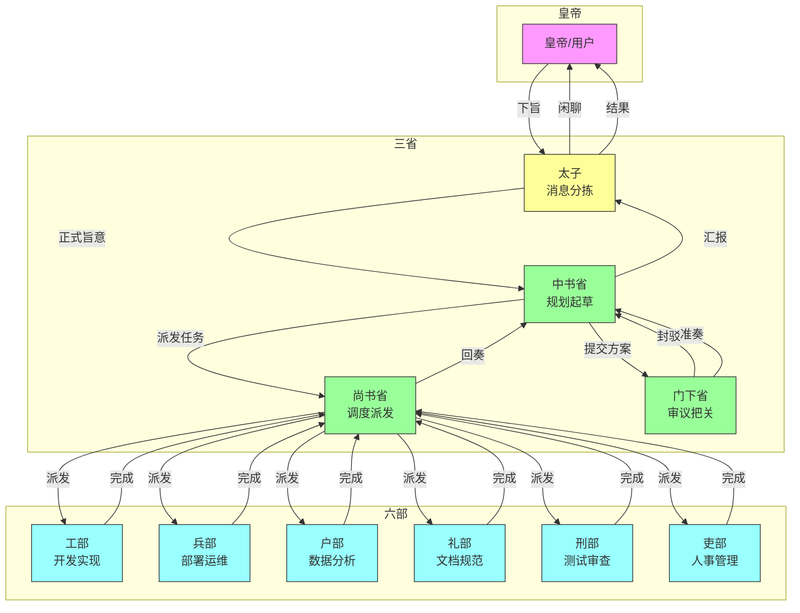
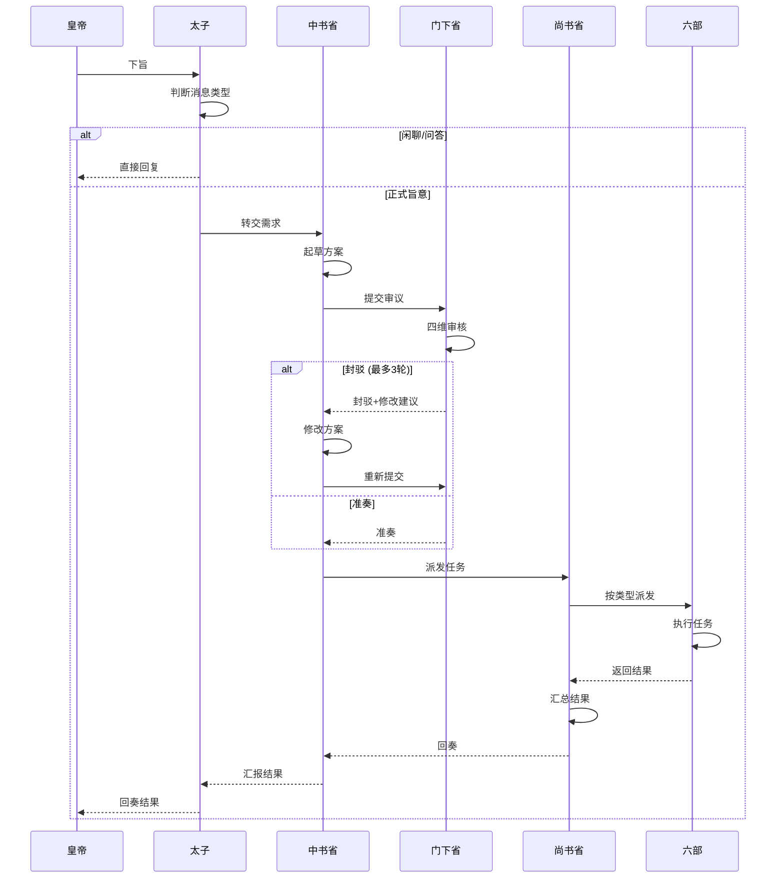
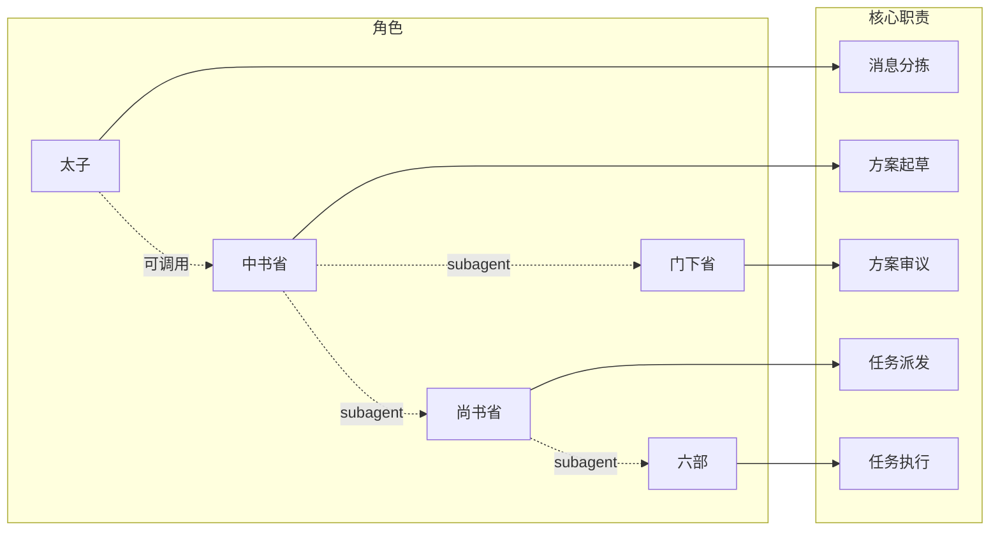
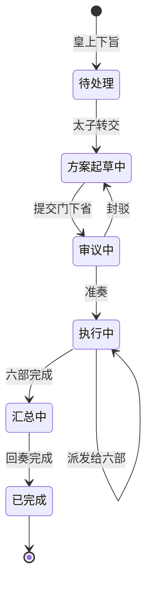

# 三省六部制 Agent 架构图

## 组织架构

```mermaid
graph TB
    subgraph 皇帝
        HM[皇帝/用户]
    end
    
    subgraph 三省
        direction TB
        TZ[太子<br/>消息分拣]
        ZS[中书省<br/>规划起草]
        SS[尚书省<br/>调度派发]
        MX[门下省<br/>审议把关]
    end
    
    subgraph 六部
        direction TB
        GB[工部<br/>开发实现]
        BB[兵部<br/>部署运维]
        HB[户部<br/>数据分析]
        LB[礼部<br/>文档规范]
        XB[刑部<br/>测试审查]
        LR[吏部<br/>人事管理]
    end
    
    HM -->|下旨| TZ
    TZ -->|闲聊| HM
    TZ -->|正式旨意| ZS
    ZS -->|提交方案| MX
    MX -->|封驳| ZS
    MX -->|准奏| ZS
    ZS -->|派发任务| SS
    SS -->|派发| GB
    SS -->|派发| BB
    SS -->|派发| HB
    SS -->|派发| LB
    SS -->|派发| XB
    SS -->|派发| LR
    GB -->|完成| SS
    BB -->|完成| SS
    HB -->|完成| SS
    LB -->|完成| SS
    XB -->|完成| SS
    LR -->|完成| SS
    SS -->|回奏| ZS
    ZS -->|汇报| TZ
    TZ -->|结果| HM
    
    style HM fill:#f9f,stroke:#333
    style TZ fill:#ff9,stroke:#333
    style ZS fill:#9f9,stroke:#333
    style SS fill:#9f9,stroke:#333
    style MX fill:#9f9,stroke:#333
    style GB fill:#9ff,stroke:#333
    style BB fill:#9ff,stroke:#333
    style HB fill:#9ff,stroke:#333
    style LB fill:#9ff,stroke:#333
    style XB fill:#9ff,stroke:#333
    style LR fill:#9ff,stroke:#333
```

## 任务流转时序图

```mermaid
sequenceDiagram
    participant 皇帝
    participant 太子
    participant 中书省
    participant 门下省
    participant 尚书省
    participant 六部

    皇帝->>太子: 下旨
    太子->>太子: 判断消息类型
    
    alt 闲聊/问答
        太子-->>皇帝: 直接回复
    else 正式旨意
        太子->>中书省: 转交需求
        中书省->>中书省: 起草方案
        中书省->>门下省: 提交审议
        门下省->>门下省: 四维审核
        
        alt 封驳 (最多3轮)
            门下省-->>中书省: 封驳+修改建议
            中书省->>中书省: 修改方案
            中书省->>门下省: 重新提交
        else 准奏
            门下省-->>中书省: 准奏
        end
        
        中书省->>尚书省: 派发任务
        尚书省->>六部: 按类型派发
        
        六部->>六部: 执行任务
        六部-->>尚书省: 返回结果
        
        尚书省->>尚书省: 汇总结果
        尚书省-->>中书省: 回奏
        中书省-->>太子: 汇报结果
        太子-->>皇帝: 回奏结果
    end
```

## 职责矩阵

```mermaid
graph LR
    subgraph 角色
        R1[太子]
        R2[中书省]
        R3[门下省]
        R4[尚书省]
        R5[六部]
    end
    
    subgraph 核心职责
        A1[消息分拣]
        A2[方案起草]
        A3[方案审议]
        A4[任务派发]
        A5[任务执行]
    end
    
    R1 --> A1
    R2 --> A2
    R3 --> A3
    R4 --> A4
    R5 --> A5
    
    R1 -.->|可调用| R2
    R2 -.->|subagent| R3
    R2 -.->|subagent| R4
    R4 -.->|subagent| R5
```

## 看板状态流转

```mermaid
stateDiagram-v2
    [*] --> 待处理: 皇上下旨
    待处理 --> 方案起草中: 太子转交
    方案起草中 --> 审议中: 提交门下省
    审议中 --> 方案起草中: 封驳
    审议中 --> 执行中: 准奏
    执行中 --> 汇总中: 六部完成
    汇总中 --> 已完成: 回奏完成
    已完成 --> [*]
    
    执行中 --> 执行中: 派发给六部
```
