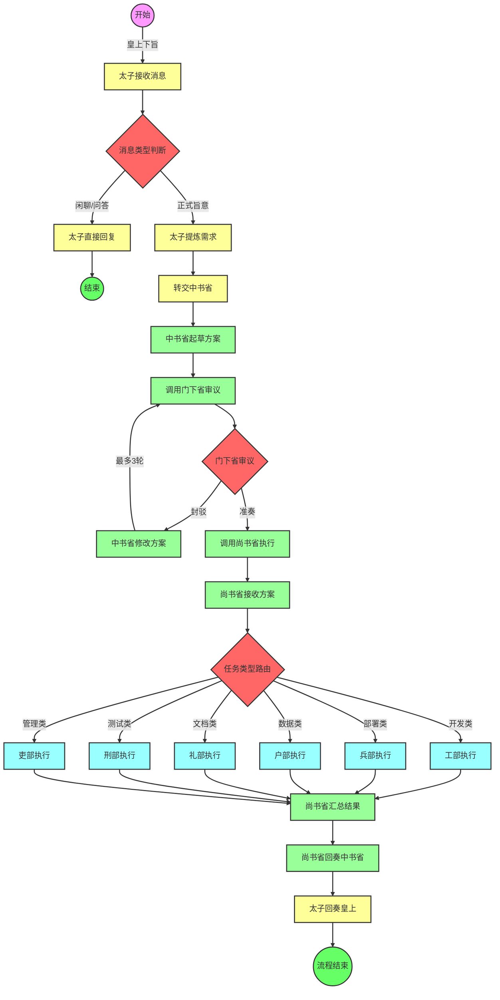
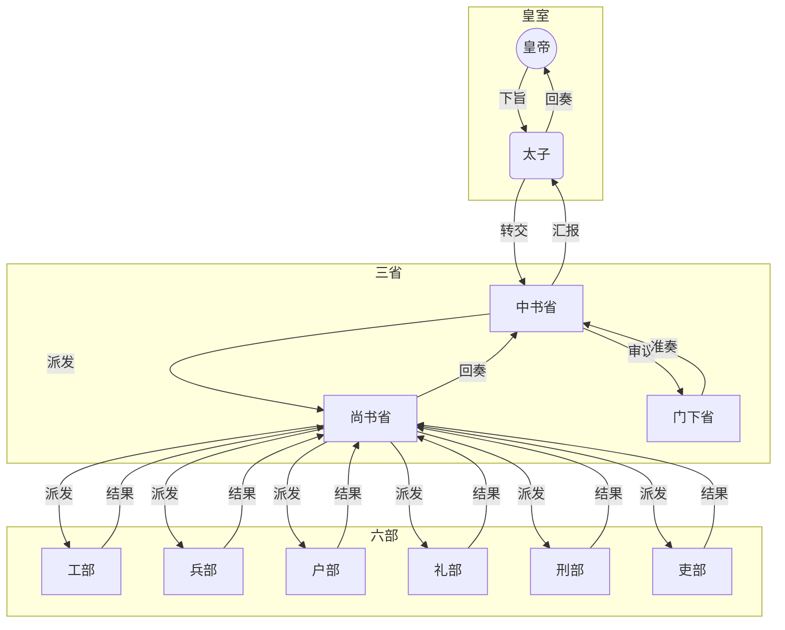
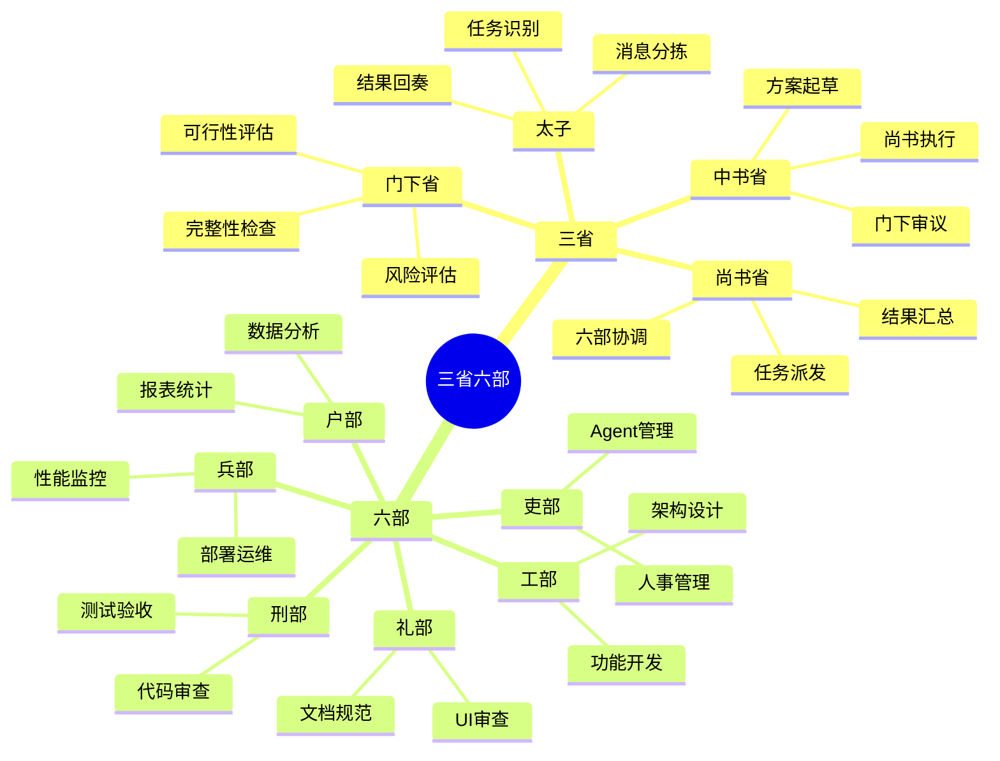

# 三省六部制执行流程

## Mermaid 流程图

```mermaid
flowchart TD
    %% 样式定义
    classDef emperor fill:#f9f,stroke:#333,stroke-width:2px
    classDef prince fill:#ff9,stroke:#333,stroke-width:2px
    classDef sansheng fill:#9f9,stroke:#333,stroke-width:2px
    classDef liubu fill:#9ff,stroke:#333,stroke-width:2px
    classDef decision fill:#f66,stroke:#333,stroke-width:2px
    classDef done fill:#6f6,stroke:#333,stroke-width:2px

    %% 开始
    Start((开始)):::emperor

    %% 太子阶段
    Start -->|皇上下旨| T1[太子接收消息]:::prince
    T1 --> T2{消息类型判断}:::decision
    
    %% 太子分拣
    T2 -->|闲聊/问答| T3[太子直接回复]:::prince
    T3 --> End1((结束)):::done
    
    T2 -->|正式旨意| T4[太子提炼需求]:::prince
    T4 --> T5[转交中书省]:::prince
    
    %% 中书省阶段
    T5 --> Z1[中书省起草方案]:::sansheng
    Z1 --> Z2[调用门下省审议]:::sansheng
    
    %% 门下省审议循环
    Z2 --> M1{门下省审议}:::decision
    M1 -->|封驳| Z3[中书省修改方案]:::sansheng
    Z3 -->|最多3轮| Z2
    
    M1 -->|准奏| Z4[调用尚书省执行]:::sansheng
    
    %% 尚书省阶段
    Z4 --> S1[尚书省接收方案]:::sansheng
    S1 --> S2{任务类型路由}:::decision
    
    %% 六部派发
    S2 -->|开发类| G1[工部执行]:::liubu
    S2 -->|部署类| B1[兵部执行]:::liubu
    S2 -->|数据类| H1[户部执行]:::liubu
    S2 -->|文档类| L1[礼部执行]:::liubu
    S2 -->|测试类| X1[刑部执行]:::liubu
    S2 -->|管理类| LR1[吏部执行]:::liubu
    
    %% 六部执行
    G1 --> S3[尚书省汇总结果]:::sansheng
    B1 --> S3
    H1 --> S3
    L1 --> S3
    X1 --> S3
    LR1 --> S3
    
    %% 回奏阶段
    S3 --> S4[尚书省回奏中书省]:::sansheng
    S4 --> T6[太子回奏皇上]:::prince
    T6 --> End((流程结束)):::done

    %% 连接线样式
    linkStyle default stroke:#333,stroke-width:2px
```

## 架构图

```mermaid
graph TB
    subgraph 皇室
        Emperor((皇帝))
        Prince(太子)
    end
    
    subgraph 三省
        ZS[中书省]
        SS[尚书省]
        MX[门下省]
    end
    
    subgraph 六部
        GB[工部]
        BB[兵部]
        HB[户部]
        LB[礼部]
        XB[刑部]
        LR[吏部]
    end
    
    Emperor -->|下旨| Prince
    Prince -->|转交| ZS
    ZS -->|审议| MX
    MX -->|准奏| ZS
    ZS -->|派发| SS
    SS -->|派发| GB
    SS -->|派发| BB
    SS -->|派发| HB
    SS -->|派发| LB
    SS -->|派发| XB
    SS -->|派发| LR
    GB -->|结果| SS
    BB -->|结果| SS
    HB -->|结果| SS
    LB -->|结果| SS
    XB -->|结果| SS
    LR -->|结果| SS
    SS -->|回奏| ZS
    ZS -->|汇报| Prince
    Prince -->|回奏| Emperor
```

## 职责对照表

```mermaid
mindmap
  root((三省六部))
    三省
      太子
        消息分拣
        任务识别
        结果回奏
      中书省
        方案起草
        门下审议
        尚书执行
      尚书省
        任务派发
        六部协调
        结果汇总
      门下省
        可行性评估
        完整性检查
        风险评估
    六部
      工部
        功能开发
        架构设计
      兵部
        部署运维
        性能监控
      户部
        数据分析
        报表统计
      礼部
        文档规范
        UI审查
      刑部
        代码审查
        测试验收
      吏部
        人事管理
        Agent管理
```
